import {
  Badge,
  StepItem,
  Steps,
  TabGroup,
  Timeline,
  TimelineItem,
} from '@components/firefly-mdx';

> [!NOTE] 这篇文章是什么
> 这是博客写作速查手册。以后忘记某个语法、Front-matter 字段、代码块参数、图表写法或 MDX 组件时，直接在这里搜索关键词即可。

本文把原 Firefly 示例文章中真正有用的写作能力集中到一个地方。目标不是从头到尾阅读，而是**搜索、复制、修改、使用**。

## 0. 最常用：新文章模板

普通文章优先使用 `.md`：

```markdown
---
title: 文章标题
published: 2026-09-01
updated: 2026-09-01
description: 一句话简介
image: ./cover.webp
tags: [AI, Research]
category: 研究
slug: example-post
pinned: false
draft: false
comment: true
---

正文从这里开始。
```

需要 `TabGroup`、`Timeline`、`Steps`、`Badge` 等组件时使用 `.mdx`，并在 Front-matter 后导入组件。

### Front-matter 字段速查

| 字段 | 用途 |
| --- | --- |
| `title` | 文章标题 |
| `published` | 发布时间 |
| `updated` | 最后更新时间，可省略 |
| `description` | 首页、搜索、SEO 使用的简介 |
| `image` | 封面图 |
| `tags` | 标签数组 |
| `category` | 分类 |
| `lang` | 文章语言与站点默认语言不同时设置 |
| `slug` | 自定义 URL |
| `pinned` | 是否置顶 |
| `draft` | `true` 时生产环境不发布 |
| `comment` | 是否开启评论 |
| `author` | 作者 |
| `sourceLink` | 来源链接 |
| `licenseName` | 许可证名称 |
| `licenseUrl` | 许可证链接 |
| `password` | 文章密码 |
| `passwordHint` | 密码提示 |

### 封面路径

```yaml
# 网络图片
image: https://example.com/cover.webp

# public 目录
image: /images/cover.webp

# 与文章放在一起
image: ./cover.webp
```

### Slug

```yaml
slug: paper-1-experiment
```

建议只用小写英文、数字和连字符。发布后尽量不要修改。

### 草稿

```yaml
draft: true
```

写完后改成：

```yaml
draft: false
```

---

## 1. Markdown 基础

### 标题

```markdown
# 一级标题
## 二级标题
### 三级标题
```

### 粗体、斜体、删除线、行内代码

```markdown
**粗体**
*斜体*
~~删除线~~
`inline code`
```

实际效果：

**粗体**、*斜体*、~~删除线~~、`inline code`

### 段落与换行

空一行表示新段落。

行末添加两个空格可以强制换行。

### 引用

```markdown
> 一级引用
>
> > 二级引用
```

> 一级引用
>
> > 二级引用

### 无序、有序和嵌套列表

```markdown
- 项目 A
  - A1
  - A2
- 项目 B

1. 第一步
2. 第二步
3. 第三步
```

- 项目 A
  - A1
  - A2
- 项目 B

1. 第一步
2. 第二步
3. 第三步

### 链接

```markdown
[下一栈](https://mkbkakwk.github.io)

[GitHub]: https://github.com/mkbkakwk
这是一个 [引用式链接][GitHub]。
```

### 图片

```markdown

```

### 表格

```markdown
| 左对齐 | 居中 | 右对齐 |
| :--- | :---: | ---: |
| A | B | C |
| 1 | 2 | 3 |
```

| 左对齐 | 居中 | 右对齐 |
| :--- | :---: | ---: |
| A | B | C |
| 1 | 2 | 3 |

### 分割线

```markdown
---
```

---

### 自动链接

```markdown
<https://mkbkakwk.github.io>
```

### 转义

```markdown
\*这不是斜体\*
1986\. 这不是有序列表
```

### 内联 HTML

普通 Markdown 可以直接使用 HTML。若文章为 `.mdx`，HTML 标签按 JSX 规则书写。

```html
<kbd>Ctrl</kbd> + <kbd>K</kbd>
```

实际效果：<kbd>Ctrl</kbd> + <kbd>K</kbd>

---

## 2. 代码块与 Expressive Code

### 基础语法高亮

````markdown
```python
def hello():
    print("Hello 下一栈")
```
````

```python
def hello():
    print("Hello 下一栈")
```

### 文件标题

````markdown
```ts title="config.ts"
export const enabled = true;
```
````

```ts title="config.ts"
export const enabled = true;
```

### 编辑器 / 终端框架

````markdown
```bash title="终端"
pnpm build
```

```sh frame="none"
echo "no frame"
```

```ps frame="code" title="PowerShell Profile.ps1"
Write-Output "code frame"
```
````

### 行高亮

````markdown
```js {1,4,7-8}
console.log("line 1");
console.log("line 2");
console.log("line 3");
console.log("line 4");
```
````

### 新增 / 删除行

````markdown
```js title="diff-example.js" del={2} ins={3} {4}
const a = 1;
const oldValue = 2;
const newValue = 3;
console.log(newValue);
```
````

```js title="diff-example.js" del={2} ins={3} {4}
const a = 1;
const oldValue = 2;
const newValue = 3;
console.log(newValue);
```

### Diff

````markdown
```diff
- const mode = "old";
+ const mode = "new";
```
````

```diff
- const mode = "old";
+ const mode = "new";
```

### 标记指定文本

````markdown
```js "important"
const message = "important";
```
````

### 正则标记

````markdown
```ts /ye[sp]/
console.log("yes yep");
```
````

### 自动换行

````markdown
```js wrap
const text = "一段非常非常长的文本";
```

```js wrap preserveIndent=false
const text = "关闭换行时的缩进保持";
```
````

### 折叠代码

````markdown
```js collapse={1-3}
import { a } from "a";
import { b } from "b";
import { c } from "c";

console.log(a, b, c);
```
````

### 行号

````markdown
```js showLineNumbers
console.log("line");
```

```js showLineNumbers startLineNumber=10
console.log("从第 10 行开始");
```
````

### Code Group

Markdown 中可以把多个代码块做成标签页：

````markdown
::: code-group labels=[JavaScript, Python]

```js
console.log("hello");
```

```py
print("hello")
```

:::
````

实际效果：

::: code-group labels=[JavaScript, Python]

```js
console.log("hello");
```

```py
print("hello")
```

:::

标签也可以写 Emoji 短代码：

```text
::: code-group labels=[:package: npm, :package: pnpm, :yarn: yarn]
```

Code Group 内仍可继续使用 `title`、行号、行标记、折叠、终端框架等 Expressive Code 参数。

---

## 3. Firefly Markdown 扩展

### GitHub 仓库卡片

```markdown
::github{repo="mkbkakwk/mkbkakwk.github.io"}
```

实际效果：

::github{repo="mkbkakwk/mkbkakwk.github.io"}

### 提醒框 / Callout

当前站点使用 GitHub 风格时，最常用的是：

```markdown
> [!NOTE] 笔记
> 补充信息。

> [!TIP] 提示
> 推荐做法。

> [!IMPORTANT] 重要
> 必须注意。

> [!WARNING] 警告
> 有风险。

> [!CAUTION] 谨慎
> 可能造成负面后果。
```

> [!NOTE] 笔记
> 这是 NOTE。

> [!TIP] 提示
> 这是 TIP。

> [!IMPORTANT] 重要
> 这是 IMPORTANT。

> [!WARNING] 警告
> 这是 WARNING。

> [!CAUTION] 谨慎
> 这是 CAUTION。

Firefly 还支持切换 Obsidian、VitePress、Docusaurus 风格。切换位置：

```ts
// src/config/siteConfig.ts
post: {
  rehypeCallouts: {
    theme: "github", // github | obsidian | vitepress | docusaurus
  },
},
```

### 剧透 Spoiler

```markdown
答案是 :spoiler[42]。
```

实际效果：

答案是 :spoiler[42]。

### 图片网格 Image Grid

语法：

```markdown
[grid]


[/grid]
```

最多适合并排展示 4 张图。图片比例不一致时会自动裁剪以对齐；完整图片仍可通过灯箱查看。

> [!NOTE]
> 本手册不绑定 Firefly 原 Demo 图片。真正使用时换成文章自己的图片即可，这样以后删除 Demo 素材不会影响本手册。

---

## 4. KaTeX 数学与化学公式

### 行内公式

```markdown
欧拉公式：$e^{i\pi}+1=0$
```

欧拉公式：$e^{i\pi}+1=0$

### 块级公式

```latex
$$
x = \frac{-b \pm \sqrt{b^2 - 4ac}}{2a}
$$
```

$$
x = \frac{-b \pm \sqrt{b^2 - 4ac}}{2a}
$$

### 矩阵

```latex
$$
\begin{pmatrix}
a & b \\
c & d
\end{pmatrix}
$$
```

$$
\begin{pmatrix}
a & b \\
c & d
\end{pmatrix}
$$

### 求和与极限

$$
\sum_{n=1}^{\infty}\frac{1}{n^2}=\frac{\pi^2}{6}
$$

$$
\lim_{x\to0}\frac{\sin x}{x}=1
$$

### 化学方程式

```latex
$$
\ce{CH4 + 2O2 -> CO2 + 2H2O}
$$
```

$$
\ce{CH4 + 2O2 -> CO2 + 2H2O}
$$

---

## 5. Mermaid

基本写法：

````markdown

````

### 流程图

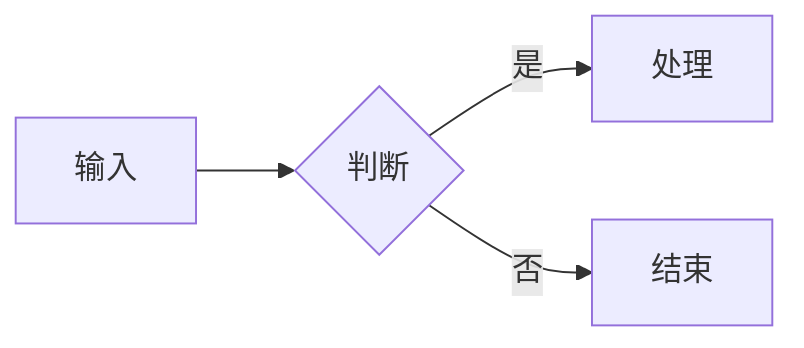

### 时序图

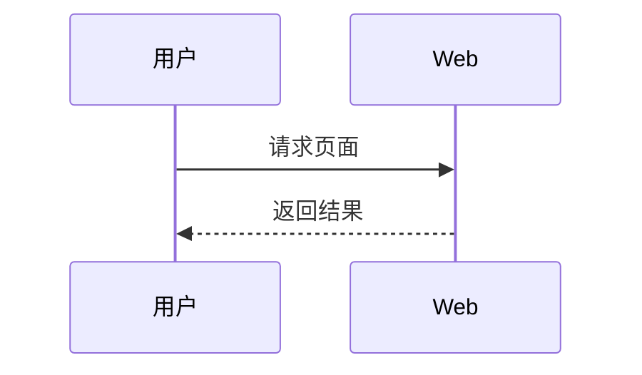

### ER 图

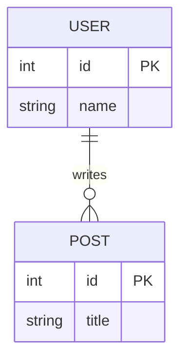

### 类图

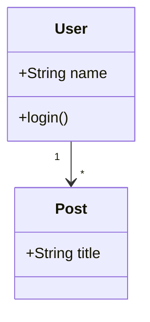

### 状态图

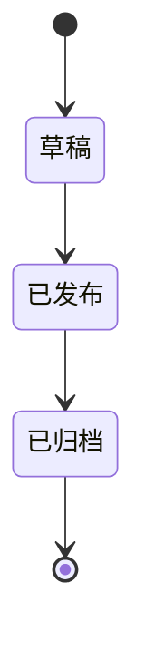

### XY 图

````markdown
```mermaid
xychart-beta
  title "访问趋势"
  x-axis [1月, 2月, 3月]
  y-axis "访问量" 0 --> 100
  bar [20, 45, 80]
  line [20, 45, 80]
```
````

### 饼图

````markdown
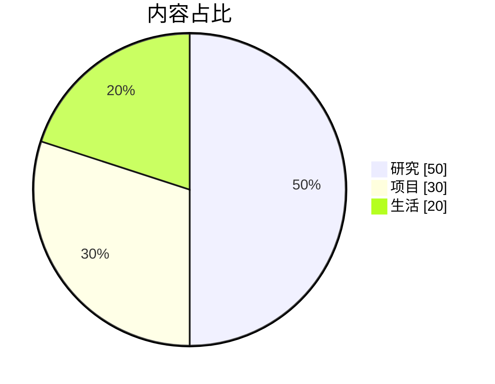
````

### 甘特图

````markdown
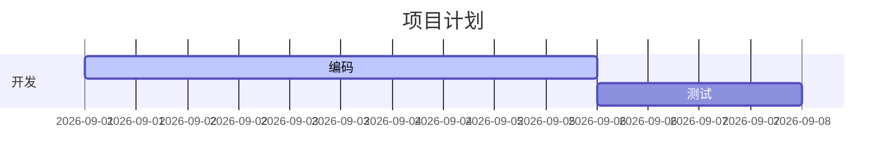
````

### 思维导图

````markdown
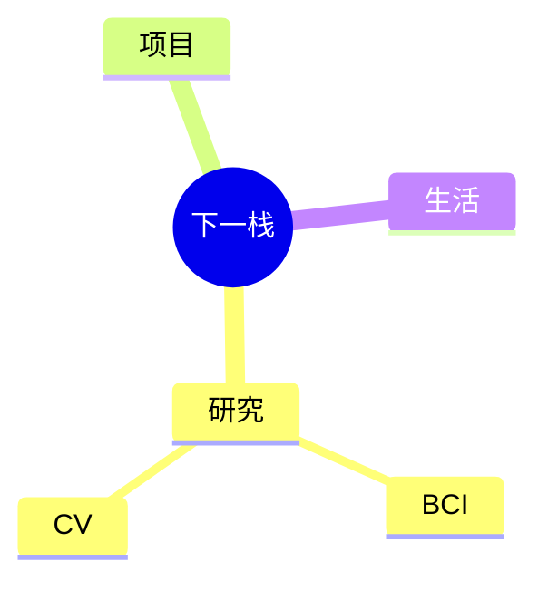
````

### 时间线

````markdown
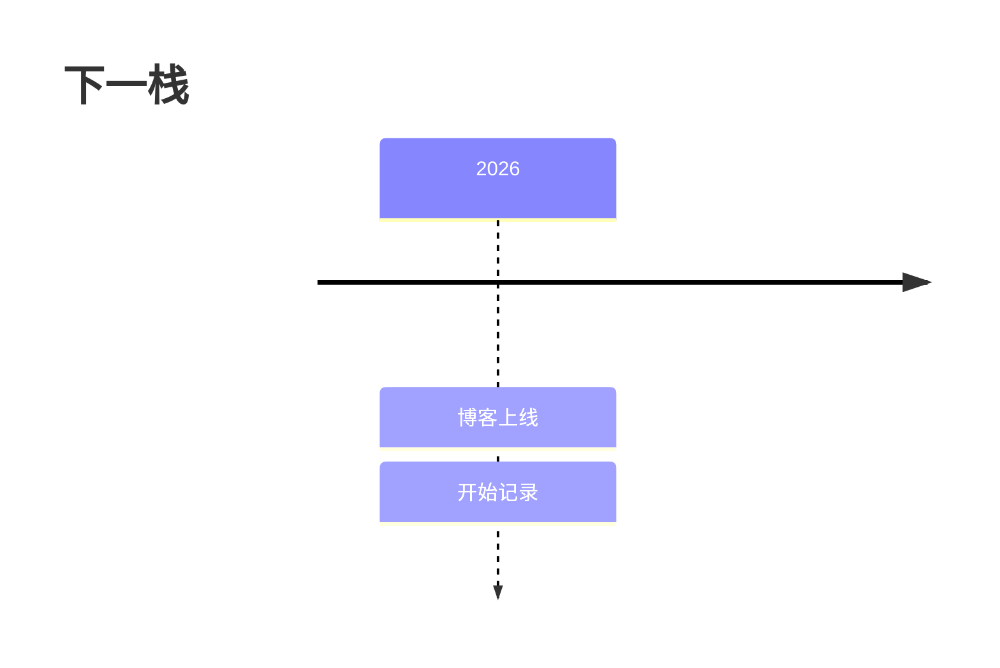
````

### 用户旅程图

````markdown
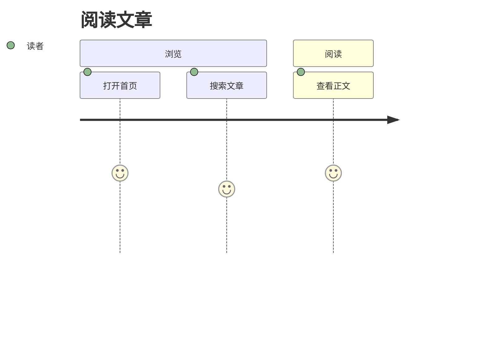
````

### Git Graph

````markdown
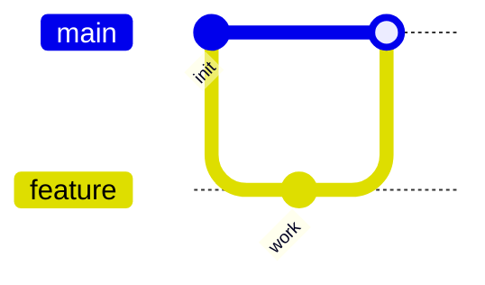
````

### Kanban

````markdown

````

### Sankey

````markdown
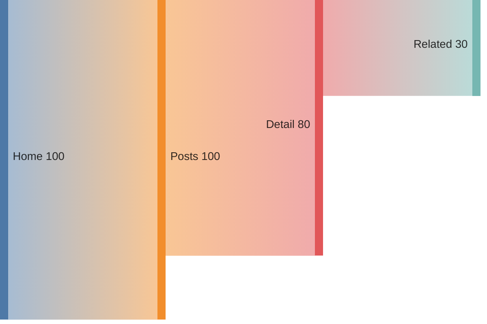
````

> [!TIP]
> Mermaid 很适合流程、论文方法图、实验流程、数据结构和项目进度。这里只保留可搜索的最小模板，真正写文章时再扩展。

---

## 6. PlantUML

最小模板：

````markdown
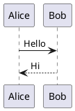
````

实际效果：


### 活动图

````markdown
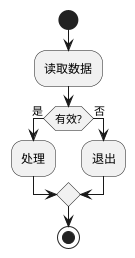
````

### 状态图

````markdown
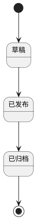
````

### 用例图

````markdown
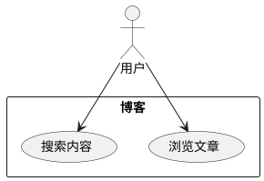
````

### 组件图

````markdown
```plantuml
@startuml
[Astro App] --> [Markdown Parser]
[Markdown Parser] --> [Search Index]
@enduml
```
````

### 部署图

````markdown
```plantuml
@startuml
node "Browser"
node "GitHub Pages"
"Browser" --> "GitHub Pages" : HTTPS
@enduml
```
````

### ER / Entity

````markdown
```plantuml
@startuml
entity User {
  *id : uuid
  name : varchar
}
entity Post {
  *id : uuid
  title : varchar
}
User ||--o{ Post : writes
@enduml
```
````

### 时序图

````markdown
```plantuml
@startuml
actor User
participant Web
participant API
User -> Web : Submit
Web -> API : Request
API --> Web : Response
Web --> User : Render
@enduml
```
````

### C4

Firefly 示例也支持通过 PlantUML 标准库写 C4 图。常见入口：

````markdown
```plantuml
@startuml
!includeurl https://raw.githubusercontent.com/plantuml-stdlib/C4-PlantUML/master/C4_Container.puml

Person(user, "访客", "阅读文章")
System_Boundary(blog, "Blog") {
  Container(web, "Web", "Astro", "静态博客")
}
Rel(user, web, "访问", "HTTPS")
@enduml
```
````

> [!WARNING]
> C4 示例依赖远程 `includeurl`。为了避免构建时外部依赖不稳定，本手册只保留语法，不强制实时渲染。

---

## 7. Wiki Link

Firefly 支持 Obsidian 风格 Wiki Link。对于长期在 Obsidian 中写作，推荐保持**文件名唯一**，或者使用相对 `src/content/posts` 根目录的完整文件路径。

### 独立文章卡片：引用本文自己

语法：

```markdown
[[blog-writing-reference]]
```

实际效果：

[[blog-writing-reference]]

### 行内链接 + 自定义显示文字

```markdown
这里返回 [[blog-writing-reference|博客写作语法与功能速查]]。
```

实际效果：

这里返回 [[blog-writing-reference|博客写作语法与功能速查]]。

### 链接到本文标题

```markdown
[[blog-writing-reference#Wiki Link|查看 Wiki Link]]
```

实际效果：

[[blog-writing-reference#Wiki Link|查看 Wiki Link]]

### 本页标题锚点

```markdown
[[#Wiki Link|返回 Wiki Link]]
```

实际效果：

[[#Wiki Link|返回 Wiki Link]]

### 三种目标写法

```text
[[slug]]
[[guide/article-path]]
[[unique-file-name]]
```

对于 Obsidian，推荐把 `src/content/posts` 看作文章根目录，并优先使用不会重名的文件名或根目录路径。

> [!NOTE]
> `![[image.png]]` 这种 Obsidian 附件嵌入语法目前不是 Firefly Wiki Link 的图片嵌入方式。文章图片仍使用标准 Markdown 图片语法。

---

## 8. 视频

### YouTube

普通 Markdown 中可以直接粘贴 iframe。若当前文章是 `.mdx`，使用 JSX 属性写法：

```html
<iframe
  width="100%"
  height="468"
  src="https://www.youtube.com/embed/VIDEO_ID"
  title="YouTube video player"
  frameBorder="0"
  loading="lazy"
  allowFullScreen
></iframe>
```

### Bilibili

```html
<iframe
  width="100%"
  height="468"
  src="//player.bilibili.com/player.html?bvid=BV_ID&p=1&autoplay=0"
  scrolling="no"
  frameBorder="0"
  loading="lazy"
  allowFullScreen
></iframe>
```

> [!NOTE]
> 手册只保留嵌入模板，不固定第三方视频，避免以后示例视频失效或自动加载无关内容。

---

## 9. 文章加密

在 Front-matter 添加：

```yaml
password: "你的密码"
passwordHint: "密码提示"
```

设置后，文章内容会变成密码保护内容。

> [!IMPORTANT]
> 本手册本身不能开启 `password`，否则“如何写文章”的搜索手册也会被锁住。因此这里以语法示例记录加密功能，而不实际启用。

---

## 10. MDX

当 Markdown 不够用，需要交互式 UI 组件时，把文章后缀改为 `.mdx`。

统一导入：

```mdx
import {
  Badge,
  StepItem,
  Steps,
  TabGroup,
  Timeline,
  TimelineItem,
} from '@components/firefly-mdx';
```

### Badge

```mdx
<Badge>默认</Badge>
<Badge type="tip">提示</Badge>
<Badge type="note">笔记</Badge>
<Badge type="important">重要</Badge>
<Badge type="warning">注意</Badge>
<Badge type="caution">危险</Badge>
```

实际效果：

<Badge>默认</Badge> <Badge type="tip">提示</Badge> <Badge type="note">笔记</Badge> <Badge type="important">重要</Badge> <Badge type="warning">注意</Badge> <Badge type="caution">危险</Badge>

### TabGroup

````mdx
<TabGroup labels={["JavaScript", "Python"]} client:load>
  ```js
  console.log("hello")
  ```

  ```py
  print("hello")
  ```
</TabGroup>
````

实际效果：

<TabGroup labels={["JavaScript", "Python"]} client:load>
  ```js
  console.log("hello")
  ```

  ```py
  print("hello")
  ```
</TabGroup>

### Timeline

```mdx
<Timeline>
  <TimelineItem date="2026-09-01" title="下一栈上线" icon="rocket">
    博客正式开始记录。
  </TimelineItem>
  <TimelineItem date="2026-08-27" title="整理写作手册" type="tip" icon="book">
    把分散的 Demo 合并为一个可搜索的参考库。
  </TimelineItem>
</Timeline>
```

实际效果：

<Timeline>
  <TimelineItem date="2026-09-01" title="下一栈上线" icon="rocket">
    博客正式开始记录。
  </TimelineItem>
  <TimelineItem date="2026-08-27" title="整理写作手册" type="tip" icon="book">
    把分散的 Demo 合并为一个可搜索的参考库。
  </TimelineItem>
</Timeline>

### Steps

```mdx
<Steps>
  <StepItem title="新建文章">
    在 `src/content/posts/` 创建 `.md` 或 `.mdx`。
  </StepItem>
  <StepItem title="本地检查" type="tip" icon="code">
    执行 `pnpm dev`。
  </StepItem>
  <StepItem title="正式构建" icon="rocket">
    执行 `pnpm build`。
  </StepItem>
</Steps>
```

实际效果：

<Steps>
  <StepItem title="新建文章">
    在 `src/content/posts/` 创建 `.md` 或 `.mdx`。
  </StepItem>
  <StepItem title="本地检查" type="tip" icon="code">
    执行 `pnpm dev`。
  </StepItem>
  <StepItem title="正式构建" icon="rocket">
    执行 `pnpm build`。
  </StepItem>
</Steps>

### Markdown Code Group 和 MDX TabGroup 怎么选

- 普通 `.md`：优先 `::: code-group`
- `.mdx`：两者都可以
- 需要把标签页放进复杂 MDX 结构：优先 `TabGroup`
- `TabGroup` 需要 `client:load` 才能激活切换

---

## 11. 站点级配置速查

这一节不是“文章语法”，但原 Firefly 示例文章也包含这些内容。保留在这里后，原布局指南就可以删除。

### 双侧栏

```ts
// src/config/sidebarConfig.ts
export const sidebarLayoutConfig = {
  enable: true,
  position: "both",
};
```

常见值：

```text
left
right
both
```

### 文章列表：列表模式

```ts
// src/config/siteConfig.ts
postListLayout: {
  defaultMode: "list",
  coverPosition: "right",
}
```

### 文章列表：网格模式

```ts
postListLayout: {
  defaultMode: "grid",
  grid: {
    masonry: false,
    columnWidth: 320,
  },
}
```

### 瀑布流

```ts
grid: {
  masonry: true,
  columnWidth: 320,
}
```

---

## 12. 一篇完整文章示例

复制下面这个模板通常就够了：

````markdown
---
title: 一篇新的研究记录
published: 2026-09-01
description: 记录实验思路、过程与结果。
tags: [Research, AI]
category: 研究
slug: research-note-001
draft: false
comment: true
---

## 问题

这里描述问题。

> [!NOTE]
> 这里记录关键前提。

## 方法

```python title="experiment.py" showLineNumbers
def run():
    return "result"
```

## 数学表达

行内：$y=f(x)$

$$
L = \frac{1}{N}\sum_{i=1}^{N}\ell_i
$$

## 流程

```mermaid
graph LR
  A[数据] --> B[模型]
  B --> C[结果]
```

## 相关文章

[[blog-writing-reference|查看博客写作语法手册]]
````

---

## 13. 最后记住这几个关键词

以后不会写时，直接在本站搜索：

```text
Front-matter
draft
slug
代码块
line marker
collapse
code group
GitHub 卡片
Callout
Spoiler
Image Grid
KaTeX
Mermaid
PlantUML
Wiki Link
视频
password
MDX
TabGroup
Timeline
Steps
Badge
Masonry
```

> [!TIP]
> 这篇手册应该随着博客能力变化而更新。新增语法时优先补到这里，而不是重新增加一批 Demo 文章。
